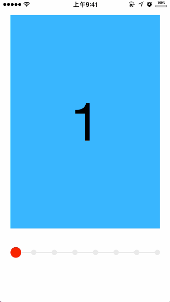
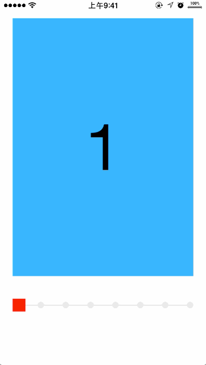

<p align="left" >
  
</p>


##Intro

A custom **UIPageControl** with multiple animations. With two animation styles:

自定义的**UIPageControl**。拥有两种动画样式:

* **GooeyCircle**

* **粘性小球** 

<p align="left" >
  
</p>

**Detail 细节**
>The longer distance the bubble moves , the severer gooey effect it has.

>粘性小球会根据移动距离的大小拥有不同的弹性程度。移动距离越大，弹性效果越明显。

* **RotateRect**
* **旋转方块**

<p align="left" >
  
</p>


> You can not only scroll the UIScrollView subclasses such as UICollectionView ,UITableView and the **KYAnimatedPageControl** can automatically move with animation ,but also you can just **TAP** the target page in the **KYAnimatedPageControl**,and the scrollview will also automatically and intelligently scroll to the target position.

>**KYAnimatedPageControl** 不仅可以在你滑动UIScrollView的时候自动以动画的形式移动，而且你还可以直接在**KYAnimatedPageControl**上的点击要滚动到的目标页，此时除了**KYAnimatedPageControl**会以动画的形式移动，UIScrollView会很智能地滑到目标页面。

##Installation

`pod 'KYAnimatedPageControl', '~> 1.0.2'`


##Usage

###Initialize:

```objc
    self.pageControl = [[KYAnimatedPageControl alloc]initWithFrame:CGRectMake(20, 450, 280, 50)];
    self.pageControl.pageCount = 8;
    self.pageControl.unSelectedColor = [UIColor colorWithWhite:0.9 alpha:1];
    self.pageControl.selectedColor = [UIColor redColor];
    self.pageControl.bindScrollView = self.demoCollectionView;
    self.pageControl.shouldShowProgressLine = YES;
    
    self.pageControl.indicatorStyle = IndicatorStyleGooeyCircle;
    self.pageControl.indicatorSize = 20;
    [self.pageControl display];
    [self.view addSubview:self.pageControl];

```

###Add methods to UIScrollViewDelegate:

```objc

#pragma mark -- UIScrollViewDelegate
-(void)scrollViewDidScroll:(UIScrollView *)scrollView{

    //Indicator动画
    [self.pageControl.indicator animateIndicatorWithScrollView:scrollView andIndicator:self.pageControl];

    if (scrollView.dragging || scrollView.isDecelerating || scrollView.tracking) {
        //背景线条动画
        [self.pageControl.pageControlLine animateSelectedLineWithScrollView:scrollView];
    }
    
}


-(void)scrollViewDidEndDecelerating:(UIScrollView *)scrollView{
    
    
    self.pageControl.indicator.lastContentOffset = scrollView.contentOffset.x;
    
}


-(void)scrollViewWillBeginDecelerating:(UIScrollView *)scrollView{

    
    [self.pageControl.indicator restoreAnimation:@(1.0/self.pageControl.pageCount)];

}

```

##版本
##Version


###v1.0.2

 增加旋转方块的抖动效果

###v1.0.1 

 增加粘性小球样式
 
###v1.0.0
  
  第一次提交：完成旋转方块样式
  

##License
This project is under MIT License. See LICENSE file for more information.


